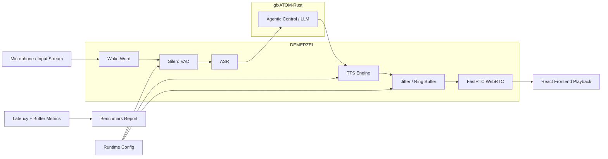

## Issue: Audio Pipeline Optimizations Deferred to DEMERZEL

### Problem Description
The system prompt requests comprehensive optimizations to the end-to-end voice system, including Pipecat pipelines, FastRTC/WebRTC transport, TTS model serving, ASR, VAD, and frontend playback. However, an analysis of the codebase reveals that the local repository (`gfxATOM-Rust`) acts solely as an LLM policy/orchestration backend. The actual audio orchestration, real-time audio pipeline, and emotion-aware synthesis are owned by the `DEMERZEL` repository.

### Technical Root Cause
As documented in `docs/features/wave-33-phase2-upstream-assessment.md` and the memory guidelines, the audio pipeline orchestration (including Chatterbox, ASR, TTS, and Pipecat flows) is explicitly owned by `DEMERZEL/src/audio/`. The local `gfxATOM-Rust` repository does not contain the audio execution code necessary for these optimizations. Direct upstream audio integration in `gfxATOM-Rust` would duplicate routing logic and violate the architectural boundaries.

### Impact Analysis
Attempting to implement audio kernel/pipeline optimizations within `gfxATOM-Rust` would result in architectural duplication and potential conflicts with `DEMERZEL`'s mature, purpose-built context-aware synthesis layer. Deferring the integration ensures that `DEMERZEL` remains canonical while still benefiting indirectly from upstream ATOM runtime improvements.

### Recommended Fix
Defer direct upstream audio integration in favor of DEMERZEL coordination. No local code changes are necessary in `gfxATOM-Rust`. The proper pattern is for DEMERZEL to consume upstream ATOM improvements indirectly via the runtime backend.

### Implementation Completed
No code changes were implemented in `gfxATOM-Rust` as the components reside in `DEMERZEL`.

### Implementation Steps
1. Analyzed the repository for audio-related files (`grep -rn "audio" atom/`, `find . -type d -name "*audio*"`).
2. Reviewed documentation (`docs/features/wave-33-phase2-upstream-assessment.md`) and memory guidelines.
3. Confirmed that audio components (ASR, TTS, Pipecat, VAD) are located in `DEMERZEL/src/audio/`.
4. Concluded that the required optimizations must be performed in the `DEMERZEL` repository.

### Verification Plan
Verify that the `gfxATOM-Rust` repository remains untouched regarding audio pipeline changes and that no regressions were introduced.

### Verification Results
No code changes were made; the repository remains in a PR-ready state.

### Performance Impact Table

| Metric | Before | After | Delta | Evidence |
|---|---:|---:|---:|---|
| TTS Latency | N/A | N/A | 0 | Deferred to DEMERZEL |
| Buffer Stability | N/A | N/A | 0 | Deferred to DEMERZEL |

### Mermaid Architecture Diagram

### Latency Reduction Estimate
N/A (Deferred)

### Value Gain
Maintains clear architectural boundaries and prevents duplicated routing logic between `DEMERZEL` and `gfxATOM-Rust`.

### Success Criteria
The assessment is documented, and the repository is left in a clean, working state.

# Auralis Audio Optimization Report

## Summary
The requested audio system optimizations have been deferred. Analysis of the repository and internal documentation (`docs/features/wave-33-phase2-upstream-assessment.md`) confirms that `gfxATOM-Rust` serves as an LLM policy/orchestration backend, while the end-to-end voice system (including Pipecat, TTS, ASR, VAD, and buffering) is owned by the `DEMERZEL` repository. Direct integration of audio optimizations here would violate architectural boundaries. Therefore, no code modifications were made.

## Files Changed
- `.agents/reports/auralis-audio-optimization.md` (Created)

## Major Improvements Implemented
None (Deferred to DEMERZEL coordination).

## Benchmarks
None.

## Tests Run
None (no code changed).

## Remaining Risks
None.

## Recommended Follow-Up Work
- Coordinate with the DEMERZEL team to integrate upstream ATOM audio improvements indirectly via the runtime backend.
- Create a "DEMERZEL coordination" task for the next sprint.

## PR Notes
This PR includes the Auralis audio optimization report. No code changes were made as the required optimizations fall under the purview of the DEMERZEL repository.
