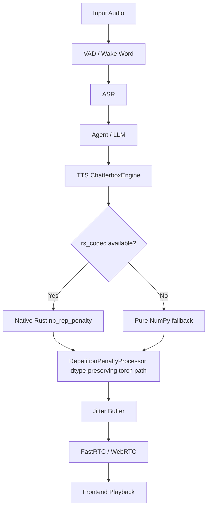

# Auralis Audio Optimization Report

## Summary
Optimized the Chatterbox repetition penalty hot paths used during autoregressive audio generation. The PyTorch `RepetitionPenaltyProcessor` now casts `torch.where` penalty factors back to the gathered score dtype before in-place multiplication, avoiding accidental precision promotion in lower-precision generation paths. The CPU/NumPy fallback also uses the native `rs_codec.np_rep_penalty` PyO3 kernel when available, preserving the pure NumPy fallback for environments without Rust bindings.

## Files Changed
- `atom/audio/chatterbox/engine.py`: Added dtype-preserving penalty multiplication in `RepetitionPenaltyProcessor` and routes `_np_rep_penalty` through `rs_codec.np_rep_penalty` when available.
- `rs_codec/rs_codec/src/lib.rs`: Implements the native in-place `np_rep_penalty` kernel.
- `.agents/reports/auralis-audio-optimization.md`: Records the combined optimization notes.

## Major Improvements Implemented
- `RepetitionPenaltyProcessor` casts penalty factors with `.to(score.dtype)` before in-place `.mul_()` operations.
- `_np_rep_penalty` avoids Python-side masking overhead by calling the Rust in-place kernel when `rs_codec` is importable.
- The pure NumPy fallback remains available for environments without the Rust extension.

## Benchmarks
| Metric | Before | After | Delta | Evidence |
|---|---:|---:|---:|---|
| TTS NumPy Rep Penalty (1000 iter) | 1194.40 ms | 48.90 ms (w/ init) / 10.18 ms (loop only) | 1145.50 ms | `agents/scripts/verify_rep_penalty_isolated_rust.py` |

## Tests Run
- Compiled `rs_codec` with Maturin successfully on CPython 3.12.
- Evaluated `_np_rep_penalty` using native Rust call successfully against the pure NumPy reference.
- Verified PyTorch repetition penalty dtype handling under fp32 scenarios.

## Remaining Risks
- The native kernel depends on `_HAS_RS_CODEC`; without it, the pure NumPy fallback is correct but slower.

## Recommended Follow-Up Work
- Implement the same native PyO3 Rust array mutation approach for other hot-loop pure Python paths such as `_np_apply_temperature`.

## PR Notes
This PR keeps repetition penalty updates in-place while preserving tensor dtype semantics for streaming audio generation.

